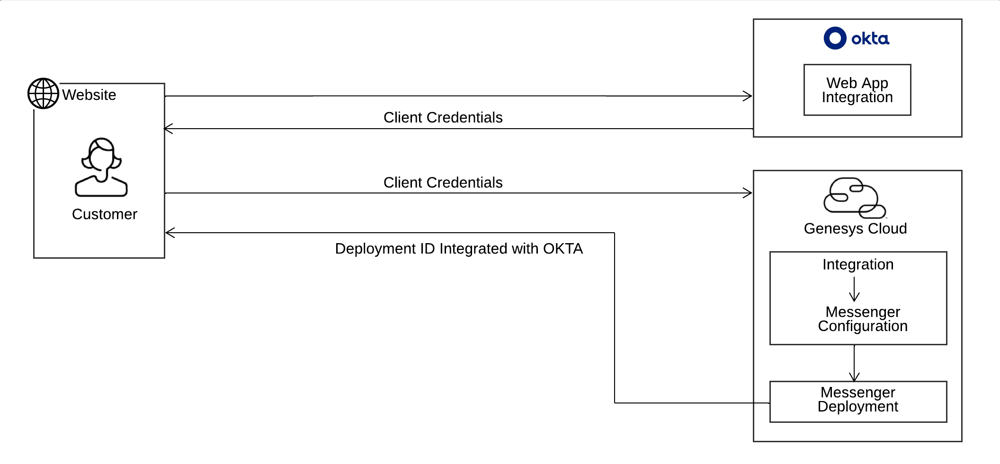

# OKTA Integration with Messenger for SSO configuration

> View the full [OKTA Integration with Messenger on Genesys Cloud Blueprint](https://developer.mypurecloud.com/blueprints/messenger-authentication-okta-integration-blueprint/index) article on the Genesys Cloud Developer Center.

This Genesys Cloud Developer Blueprint provides instructions to integrate web messenger with OKTA to perform SSO integration. The blueprint also contains steps for setting up an OKTA account to get authorization credentials.