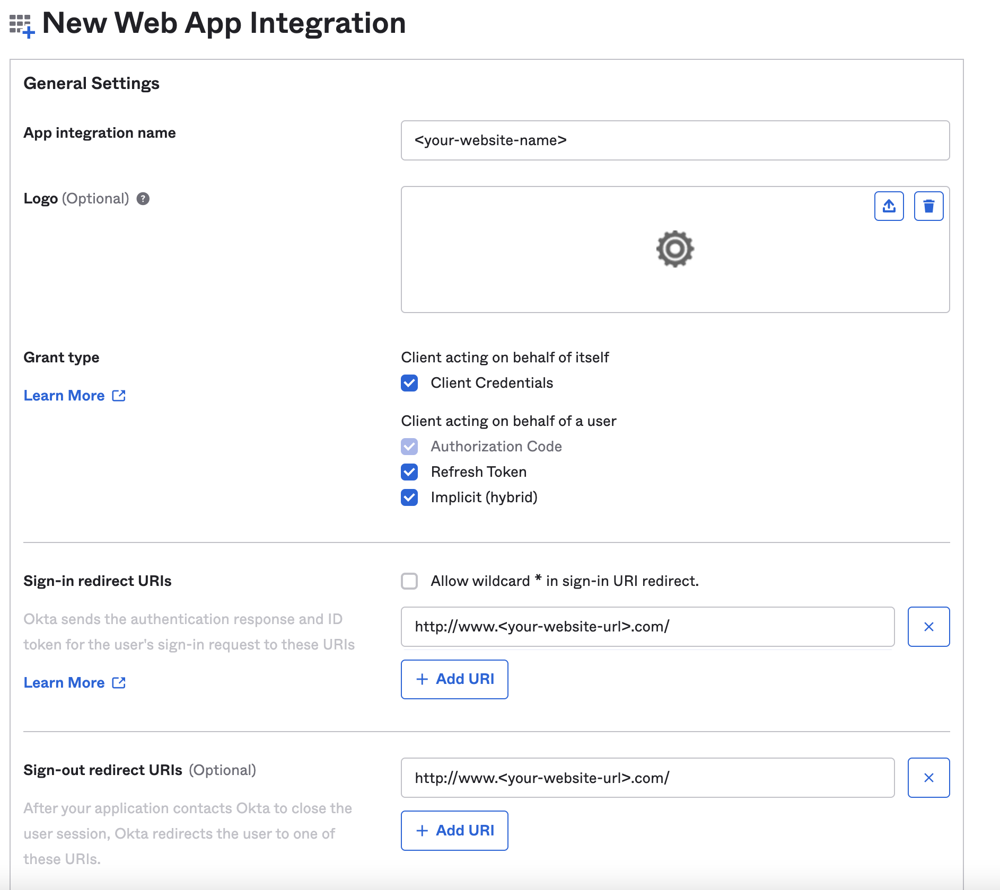
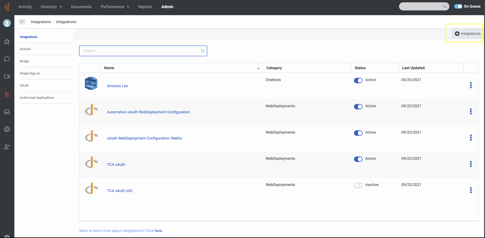
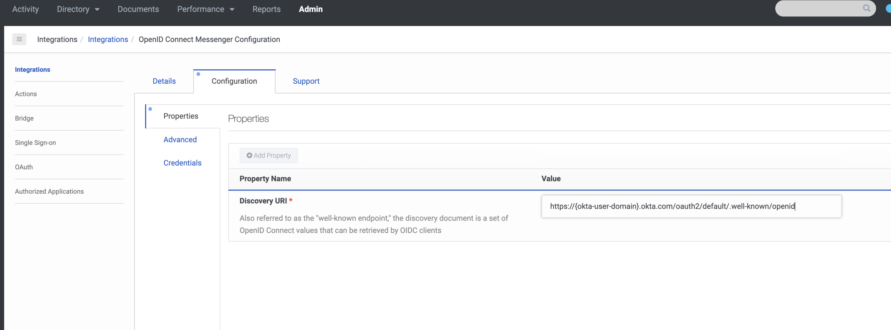
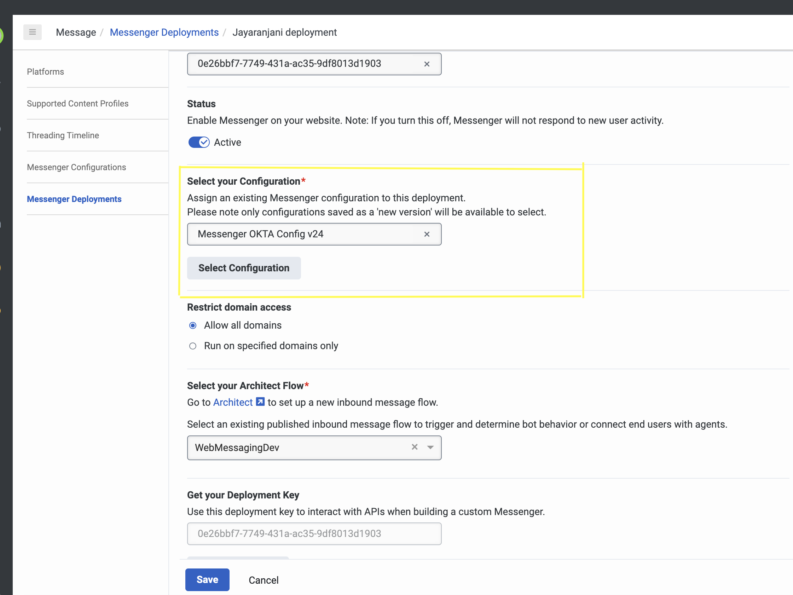
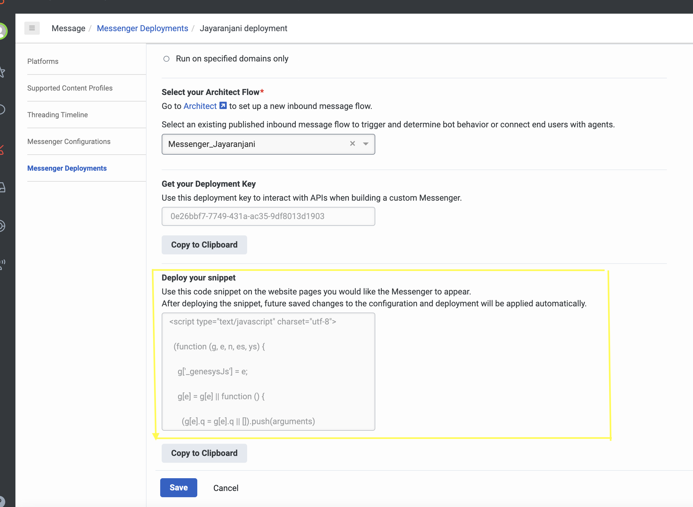

## Purpose

This page explains the steps that the users should follow to **Integrate Messenger** with the **Identity Provider-OKTA** via Genesys Cloud.

## Contents

- Solution components
- Prerequisites
- Implementation steps

## Solution components

**Genesys Cloud** - A suite of Genesys cloud services for enterprise-grade communications, collaboration, and contact center management. In this solution, a Genesys Cloud user account is required in order for the Messenger to be authorized to integrate with Genesys Cloud.

## Prerequisites

## Specialized knowledge

Administrator-level knowledge of Genesys Cloud

## Genesys Cloud account

- A Genesys Cloud license. For more information on licensing, see [Genesys Cloud Pricing](https://www.genesys.com/pricing).
- The Master Admin role in Genesys Cloud. For more information, see [Roles and permissions overview](https://help.mypurecloud.com/articles/about-roles-permissions/) in the Genesys Cloud Resource Center.

## OKTA Developer account

- An OKTA developer account. To create an OKTA developer account, refer [this](https://developer.okta.com/signup/) link.

## Implementation Steps

Follow these instructions to integrate OKTA with Messenger.

- [OKTA Set up](#okta-set-up "Goes to the OKTA Set up section")
- [Configure Genesys Cloud](#configure-genesys-cloud "Goes to Configure Genesys Cloud")
- [ADMIN UI Integration](#admin-ui-integration "Goes to ADMIN UI Integration")
- [Messenger Configuration](#messenger-configuration "Goes to Messenger Configuration")
- [Messenger Deployment](#messenger-deployment "Goes to Messenger Deployment")
## OKTA Set-Up:

1. Login to your **OKTA** developer account.
2. In the left panel, select **Applications > Applications**. 
3. Click **Create App Integration**.

  

4. On the Create a new app integration page, select OpenID Connect in the Sign-in method section.
5. Choose, **Web Application** in Application Type and click next.
6. In the **New web app Integration page**, fill the following: 
      - In **App integration name**, enter a name for your app integration or leave it as default.
      - Select the required **Grant type**. 
      - Fill **Sign-in redirect URIs**. For local development use - http://{local_domain_name}. Example: http://  localhost:8080/
      - Similarly, fill **Sign-out redirect URIs**(http://{local_domain_name}).

7. In Assignments, leave **Allow everyone in your organization to access**  as default and click Save. This creates the client credentials.

8. Store the Client credentials safely for using it in [OpenID Connect Messenger Configuration](#openid-connect-messenger-configuration "Goes to OpenID Connect Messenger Configuration").

## Configure Genesys Cloud

To enable communication from **Genesys Cloud** to **Messenger** you must make changes in, 
  1. OpenID Connect Messenger Configuration
  2. Messenger Configuration
  3. Messenger Deployment

Login to Genesys Cloud account with your **Organization** and click **Admin** tab.

## OpenID Connect Messenger Configuration:

- In ADMIN UI, type **Integrations** on the search box.
- Select **Integrations** and click **+Integrations** button are the right corner. 

  

- Install **OpenID Connect Messenger Configuration**.

  

- In **Configuration** section, place the Discovery Uri - https://accounts.google.com/.well-known/openid-configuration.

  

- In **Credentials** section, click Configure and fill your client credentials created in **OKTA** Set-up step.
- Click save.
- Navigate to the main Integrations page and set your integration to Active.

  

## Messenger Configuration:

-  In ADMIN UI, type **Messenger Configuration** on the search box.
- Under **Messenger Configuration**, enable Messenger configuration for Authenticated session.
- Select the **OAuth integration** created from ADMIN UI Integration from the dropdown.

  
  
- Now you are ready with **OKTA** set-up.

## Messenger Deployment:

- In ADMIN UI, type **Messenger Deployment** on the search box.
- Under **Messenger Deployment**, select the **Configuration** created in the [Messenger Configuration](#messenger-configuration "Goes to Messenger Configuration step")

 

 - Save the deployment. This creates a code Snippet.
 - Use this code snippet on the website pages you would like the Messenger to appear.

 

 - After deploying the snippet, future saved changes to the configuration and deployment will be applied automatically.
