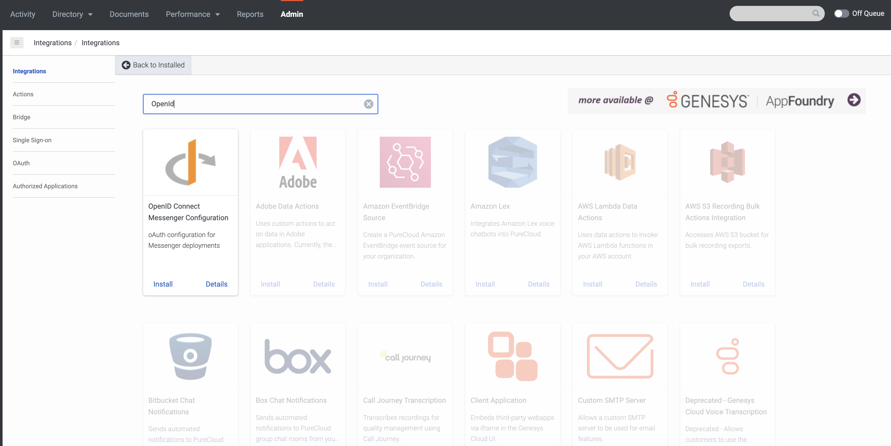
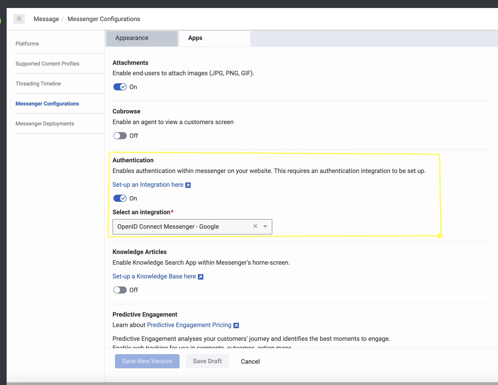

## Purpose

This page explains the steps that the developers should follow to **Integrate Messenger** with the **Identity Providers-OKTA** via Admin UI.

:::info
Messenger adapts **OKTA** for Authorization, which follows **OAuth2.0** protocol.
:::

## Contents

- Solution components
- Prerequisites
- Implementation steps

## Solution components

**Genesys Cloud** - A suite of Genesys cloud services for enterprise-grade communications, collaboration, and contact center management. In this solution, a Genesys Cloud user account is required in order for the Angular app to be authorized to integrate with Genesys Cloud.

## Prerequisites

## Specialized knowledge

Administrator-level knowledge of Genesys Cloud

## Genesys Cloud account requirements

- A Genesys Cloud license. For more information on licensing, see [Genesys Cloud Pricing](https://www.genesys.com/pricing).
- The Master Admin role in Genesys Cloud. For more information, see [Roles and permissions overview](https://help.mypurecloud.com/articles/about-roles-permissions/) in the Genesys Cloud Resource Center.

## Implementation Steps

Follow these instructions to integrate OKTA with Messenger.
## OKTA Set-Up:

1. Create an OKTA developer account from https://developer.okta.com/signup/ (opens new window)
2. In the left panel, select Applications → Applications. Select 'Create App Integration'.
3. On the Create a new app integration page, select OpenID Connect in the Sign-in method section.
4. Choose, **Web Application** in Application Type and click next.
5. In the **New web app Integration page**, fill App integration name, Grant type, Sign-in redirect URIs(http://{local_domain_name}) and Sign-out redirect URIs(http://{local_domain_name}).

6. In Assignments, leave **Allow everyone in your organization to access**  as default and click Save. This creates the client credentials.
7. Store the Client credentials safely for later use.

## ADMIN UI Integration:

- In ADMIN UI, click **Admin**.
- Under **Integrations**, select **+Integrations** button are the right corner. 

  

- Install **OpenID Connect Messenger Configuration**.

  

- In **Configuration** section, place the Discovery Uri - https://accounts.google.com/.well-known/openid-configuration.

  

- In **Credentials** section, click Configure and fill your client credentials created in **OKTA** Set-up step.
- Click save.

## Messenger Configuration:

- In ADMIN UI, click **Admin**.
- Under **Messenger Configuration**, enable Messenger configuration for Authenticated session.
- Select the **OAuth integration** created from ADMIN UI Integration from the dropdown.

  
  
- Now you are ready with **OKTA** set-up.
