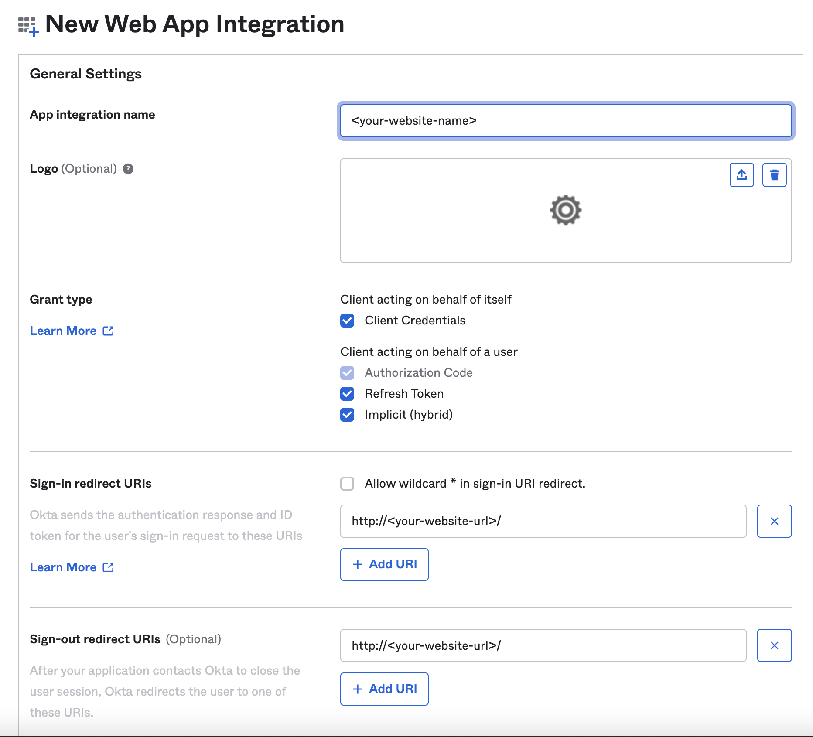
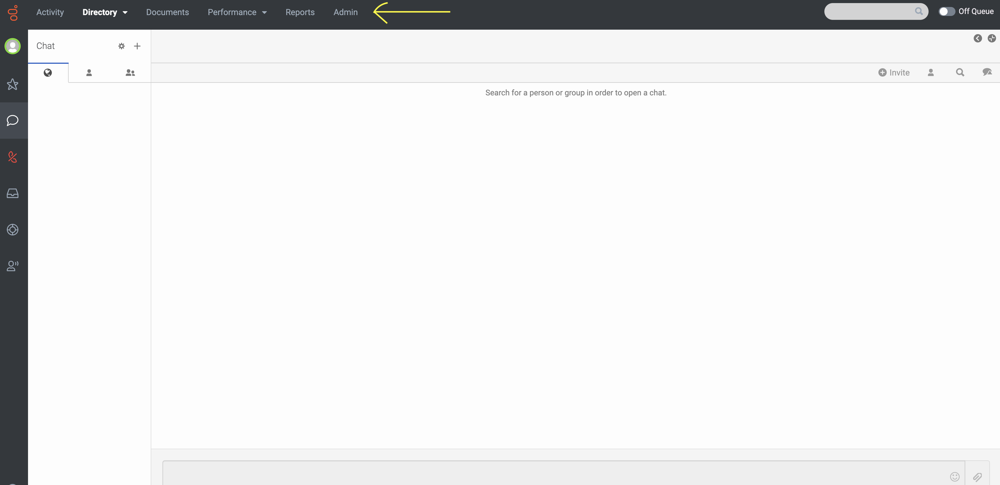
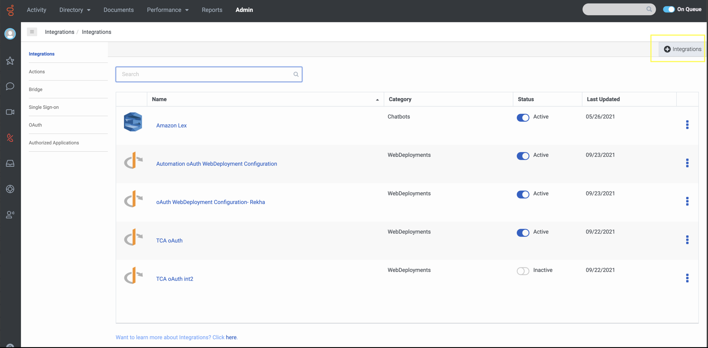
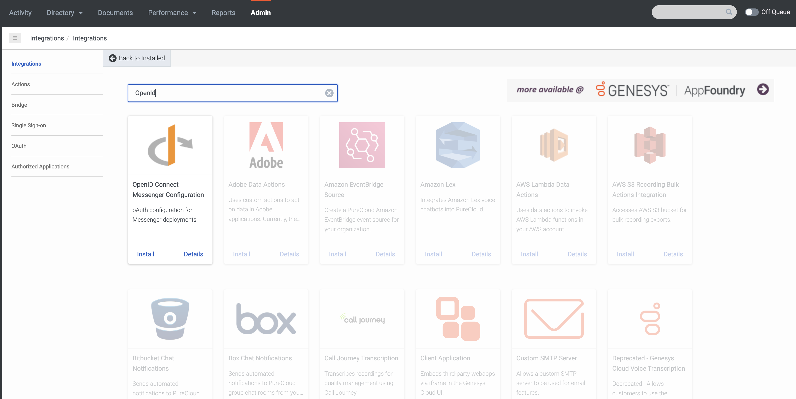
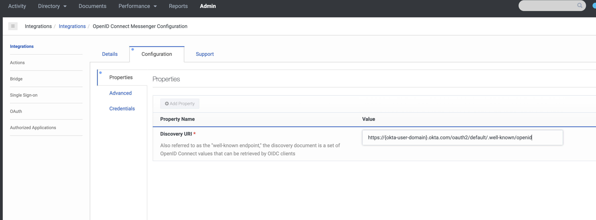
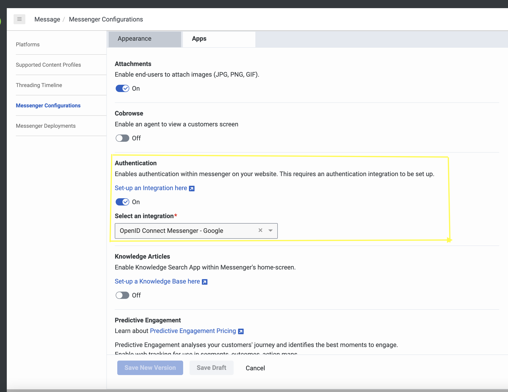
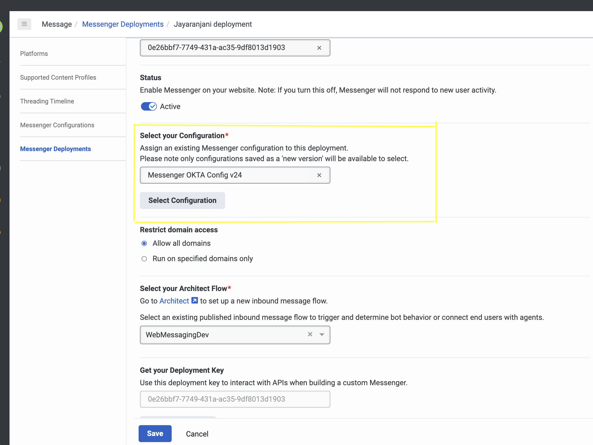
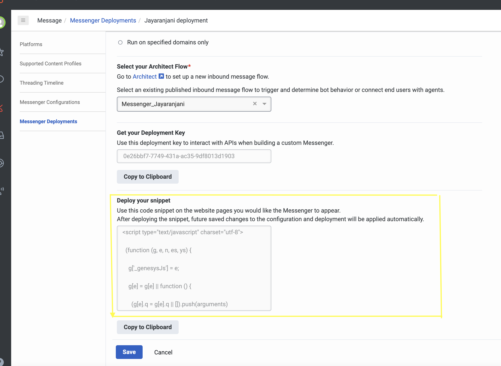

This Genesys Cloud Developer Blueprint provides instructions to integrate web messenger with OKTA to perform SSO integration. The blueprint also contains steps for setting up an OKTA account to get authorization credentials.


## Purpose

This page explains the steps that the users should follow to **Integrate Messenger** with the **Identity Provider-OKTA** via Genesys Cloud.

## Contents

- Solution components
- Prerequisites
- Implementation steps

## Solution components

**Genesys Cloud** - A suite of Genesys cloud services for enterprise-grade communications, collaboration, and contact center management. In this solution, a Genesys Cloud user account is required for your application to be authorized to integrate with Messenger.

## Prerequisites

## Specialized knowledge

Administrator-level knowledge of Genesys Cloud

## Genesys Cloud account

- A Genesys Cloud license. For more information on licensing, see [Genesys Cloud Pricing](https://www.genesys.com/pricing).
- The Master Admin role in Genesys Cloud. For more information, see [Roles and permissions overview](https://help.mypurecloud.com/articles/about-roles-permissions/) in the Genesys Cloud Resource Center.

## OKTA Developer account

- An OKTA developer account. To create an OKTA developer account, refer [this](https://developer.okta.com/signup/) link.

## Implementation Steps

Follow these instructions to integrate OKTA with Messenger.

- [OKTA Set up](#okta-set-up "Goes to the OKTA Set up section")
- [Configure Genesys Cloud](#configure-genesys-cloud "Goes to Configure Genesys Cloud")
	- [Genesys Cloud Integration](#integration "Goes to Genesys Cloud Integration")
	- [Messenger Configuration](#messenger-configuration "Goes to Messenger Configuration")
	- [Messenger Deployment](#messenger-deployment "Goes to Messenger Deployment")
- [Configure authenticated messenger](#configure-authenticated-messenger "Goes to Auth Provider set up")

## OKTA Set-Up

1. Login to your **OKTA** developer account.
2. In the left panel, select **Applications > Applications**. 
3. Click **Create App Integration**.

  

4. On the Create a new app integration page, select OpenID Connect in the Sign-in method section.
5. Choose, **Web Application** in Application Type and click next.
6. In the **New web app Integration page**, fill the following: 
      - In **App integration name**, enter a name for your app integration or leave it as default.
      - Select the required **Grant type**. 
      - Fill **Sign-in redirect URIs**. For local development use - http://{local_domain_name}. Example: http://localhost:8080/. *Note: Using localhost is just a way to test locally. This has to be the actual URL where messenger will initialize after login*
      - Similarly, fill **Sign-out redirect URIs**(http://{local_domain_name}).
7. Add your web page origin in OKTA account under Security --> API --> Trusted origins.

	
	
8. In **Assignment** section, select option which best suites your organization and click Save. This creates the client credentials.
9. Okta URL can be found by navigating to Security --> API. Click default, Okta URL will be present at the **Issuer** section.
10. Store the Client credentials safely for using it in [Integration](#integration "Goes to Integration") and note the Okta URL for using it during logging into Messenger.

Now you are ready with **OKTA** set-up.

## Configure Genesys Cloud

To enable communication from **Genesys Cloud** to **Messenger** you must make changes in, 
  1. Integration
  2. Messenger Configuration
  3. Messenger Deployment

Login to Genesys Cloud account with your **Organization** and click **Admin** tab.


## Integration

1. In **Genesys Cloud > Admin > Integrations**, click **+Integrations** button are the right corner. 

  

2. Install **OpenID Connect Messenger Configuration**.

  

3. In **Configuration** section, place the Discovery Uri - https://<okta-user-domain>/oauth2/default/.well-known/openid-configuration.

  

4. In **Credentials** section, click Configure and fill your client credentials created in **OKTA** Set-up step.
5. Click save.
6. Navigate to the main Integrations page and set your integration to **Active**.

  

## Messenger Configuration

1. In **Genesys Cloud > Admin > Messenger Configuration**, enable Authentication.
2. Select the **OAuth integration** created from [Genesys Cloud Integration](#integration "Goes to Genesys Cloud Integration step") from the dropdown.

  

## Messenger Deployment

1. In **Genesys Cloud > Admin > Messenger Deployment**, select the **Configuration** created in the [Messenger Configuration](#messenger-configuration "Goes to Messenger Configuration step")

 

3. Save the deployment. This creates a single Snippet.
4. Use this single snippet on the website you would like the Messenger to appear.

 

:::info
 Note: Note the deployment Id and environment from snippet to play with sample authentication app .
:::

## Configure authenticated messenger

Write necessary code to configure messenger for authenticated web messaging in your webpage.

1. To enable OKTA Sign-In experience, using JavaScript there are two approaches.
  A. Including [Okta Auth JavaScript SDK](https://global.oktacdn.com/okta-auth-js/5.2.2/okta-auth-js.min.js 'Okta Auth JavaScript SDK') in your page.
  B. Using OAuth 2.0 Endpoint.

	**A.Okta Sign-In using SDK:**

	- Include the okta-auth-js library in your web page.

	```{"title":"OKTA SDK","language":"html"}
	<script src="https://global.oktacdn.com/okta-auth-js/5.2.2/okta-auth-js.min.js" type="text/javascript"></script>
	```

	- Create an instance of the OktaAuth object to configure the OKTA authorization options.

	```{"title":"OktaAuth Object","language":"JavaScript"}
	const oktaConfig = {
		redirectUri: <signInRedirectUri>,
		postLogoutRedirectUri: <signOutRedirectUri>,
		clientId: <ClientId>,
		issuer: <Okta URL>,
		scopes: ['openid', 'email', 'profile', 'offline_access'],
		pkce: true,
		responseType: 'code',
		maxAge : <MaxAge>
	};
	const authClient = new OktaAuth(oktaConfig)		
	```

	- The OktaAuth object contains the following parameters:
	| Parameter | Description |
	| --------- |----------|
	| redirectUri | Specify the url where the browser should be redirected after signIn. This must be your full page URL which is listed in your Okta application's Sign-in redirect URIs.|
	| postLogoutRedirectUri | Specify the url where the browser should be redirected after signOut. This must be your full page URL which is listed in your Okta application's Sign-out redirect URIs. If not specified, your application's origin (window.location.origin) will be used.|
	| clientId | Specify the clientID which was generated when the Okta app was created. Refer [OKTA Set-Up](#okta-set-up)|
	| issuer | Specify the Okta URL present in your OKTA-Developer account under Security --> API --> default|
	| scopes| Set auth scopes to specify what access privileges are being requested as part of the authorization, if required.|
	| pkce | Default value is true which enables the PKCE OAuth Flow. To use the Implicit Flow or Authorization Code Flow, set pkce to false. *Note : PKCE flow works only with secure domain.* |
	| responseType| Set to **code** indicating that we are using the Authorization Code grant type.|
	| maxAge | Allowable elapsed time, in seconds, since the last time the end user was actively authenticated by Okta.|
	| nonce | A random string value generated by OKTA SDK. Nonce can also be passed as a paramater to OktaAuth object which rewrites the generated nonce value by OKTA SDK.|
	{: class="table-striped table-bordered"}

	- Trigger the signIn action by calling the OKTA SDK's method **signInWithRedirect** with the request parameters. The **originalUri** parameter in options to track the route before the user signIn, and the addtional parameters are mapped to the Authorize options. This could be triggered with the help of link, button, etc.,

	```{"title":"OktaAuth signInWithRedirect method","language":"JavaScript"}
	authClient.signInWithRedirect({
		originalUri: <your current page url here>,
		...oktaConfig
	});
	```

	**B. Okta Sign-In using Endpoint:**

	- Generate **Auth URL** and trigger the login action. This could be triggered with the help of link, button, etc.,

	```{"title":"Auth url Example","language":"html"}
	//Your request URL would look something like this

	authURL = `<DomainURL>client_id=<ClientId>&scope=openid%20email%20profile%20offline_access&response_type=code&redirect_uri=<RedirectURL>&state=eyJiYWNrVG9QYXRoIjoiL3ByaXZhdGUiLCJpc3N1ZXIiOiJva3RhIiwiYnl0ZXMiOiItSEhlWEV3YmNRak5fQWl3a0NkanVDNEZpQ1VPRV81emkzeFlKa1BQaWcwIn0%3D`

	//Your request URL would look something like this if pkce flow is enabled

	authURL = `<DomainURL>client_id=<ClientId>&scope=openid%20email%20profile%20offline_access&response_type=code&redirect_uri=<RedirectURL>&state=eyJiYWNrVG9QYXRoIjoiL3ByaXZhdGUiLCJpc3N1ZXIiOiJva3RhIiwiYnl0ZXMiOiItSEhlWEV3YmNRak5fQWl3a0NkanVDNEZpQ1VPRV81emkzeFlKa1BQaWcwIn0%3D&code_challenge_method=S256&code_challenge=<codeChallenge>`

	//Your request URL would look something like this if optional parameter(nonce & maxAge) is added

	authURL = `<DomainURL>client_id=<ClientId>&scope=openid%20email%20profile%20offline_access&response_type=code&redirect_uri=<RedirectURL>&state=eyJiYWNrVG9QYXRoIjoiL3ByaXZhdGUiLCJpc3N1ZXIiOiJva3RhIiwiYnl0ZXMiOiItSEhlWEV3YmNRak5fQWl3a0NkanVDNEZpQ1VPRV81emkzeFlKa1BQaWcwIn0%3D&nonce=<nonce>&max_age=<maxAge>`
	```

	- The Auth URL contains the following parameters:
	| Parameter | Description |
	| --------- |----------|
	| DomainURL | Authorization server's endpoint(https://{yourOktaDomain}/oauth2/default/v1/authorize)|
	| ClientId  | Specify the clientID which was generated when the Okta app was created. Refer [OKTA Set-Up](#okta-set-up)|
	| RedirectURL| Specify the url where the browser should be redirected after signIn. This must be your full page URL which is listed in your Okta application's Sign-in redirect URIs.|
	| Auth scopes| Set auth scopes to specify what access privileges are being requested as part of the authorization, if required.|
	| response_type| Set to **code** indicating that we are using the Authorization Code grant type|
	| max_age | Allowable elapsed time, in seconds, since the last time the end user was actively authenticated by Okta.|
	| nonce | A random string value preferably an uuid format which is returned in the ID token. |
	| codeChallenge | A string value generated from code verifier to support PKCE flow in OAuth. The code challenge is verified in the access token request. *Note: Code verifier is a random string value between 43 and 128 characters long. Okta uses it to recompute the code_challenge and verify if it matches the original code_challenge in the authorization request.* |
	| codeChallengeMethod | Method used to derive the code challenge for PKCE flow. Valid value: S256. |
		{: class="table-striped table-bordered"}

2. If the user doesn't have an existing session, making this request opens the **OKTA** sign-in page.
3. If they have an existing session, they arrive at the specified redirect_uri along with a code as shown in the code snippet.

```{"title":"Redirect url appended with code and state Example","language":"javascript"}
https://mypureclloud.com/?code=P5I7mdxxdv13_JfXrCSq&state=state-296bc9a0-a2a2-4a57-be1a-d0e2fd9bb601 // Code specifies OKTA authcode
```

4. Page reload takes place when redirection happens from **OKTA**. This initializes [Auth plugin](https://developer.genesys.cloud/api/digital/webmessaging/messengersdk/SDKCommandsEvents#auth-plugin 'Goes to the SDK Commands and Events page') and calls its command [getTokens](https://developer.genesys.cloud/api/digital/webmessaging/messengersdk/SDKCommandsEvents#auth-plugin 'Goes to the SDK Commands and Events page') for Authentication.
5. Split the **OKTA** authcode from the redirect url.
6. Create your own authprovider plugin and register the command [getAuthCode](https://developer.genesys.cloud/api/digital/webmessaging/messengersdk/SDKCommandsEvents#authprovider-plugin 'Goes to the SDK Commands and Events page').

```{"title":"Prepare the AuthProvider plugin","language":"javascript"}
Genesys('registerPlugin', 'AuthProvider', (AuthProvider) => {

  // COMMAND
  // *********
  // getAuthCode

  const urlParams = new URLSearchParams(window.location.search); // Get the authorization response which is added as a query string from the redirect URL
  const authCode = urlParams.has('code') ? urlParams.get('code'); // Get code from the query string

  /* Register Command - mandatory */

  AuthProvider.registerCommand('getAuthCode', (e) => {

  //Messenger will call this command to get the the tokens.

  e.resolve({
      authCode: <authCode>,			// Pass your authCode here
      redirectUri: <your redirect uri>,	// Pass the redirection URI configured in your Authentication provider here
      nonce: <nonce>,				// For Sign-In using SDK approach, pass the random string value stored in session storage. For endpoint approach, generate a random string value
      maxAge: <maxAge>				// Pass elapsed time in seconds and it is an optional parameter
      codeVerifier: <codeVerifier>		// For PKCE flow : If SDK approach is used, get code verifier from session storage. If endpoint approach is used, pass a cryptographically random string which you used to generate codeChallenge
    });
  });
});
```

7. Trigger the signOut action by calling the OKTA SDK's method **signOut**. This method should be called after [Auth.logout](https://developer.genesys.cloud/api/digital/webmessaging/messengersdk/SDKCommandsEvents#auth-logout 'Goes to Auth provider plugin') command. This could be triggered with the help of link, button, etc.,

```{"title":"OktaAuth signOut method","language":"JavaScript"}
AuthProvider.command('Auth.logout').finally(() => {
	authClient.signOut();
});
```

### Run the sample app

You can run the sample app locally or from the blueprint repo.

:::primary
**Note**: Regardless of where you run the sample app from, you need a Genesys Cloud user account in order for it to work. Our sample app uses [Okta Sign-In using SDK](#configure-authenticated-messenger) approach.
:::

To run the sample app from the blueprint repo:

1. Click [here](https://genesyscloudblueprints.github.io/messenger-authentication-okta-integration-blueprint/oauth.html "Goes to the sample app").

2. Enter the environment and deployment id configured With Okta. Click Submit.

3. Enter the client credentials for authenticated web messaging.

:::info
 Refer the source code for sample app [here](https://github.com/GenesysCloudBlueprints/messenger-authentication-okta-integration-blueprint/blob/main/docs/oauth.html "Goes to source code of the sample app")
:::

  For more information, see [Platform API](/api/digital/webmessaging/authenticate "Goes to the Authenticated WebMessaging page in the Genesys Cloud Developer Center").
