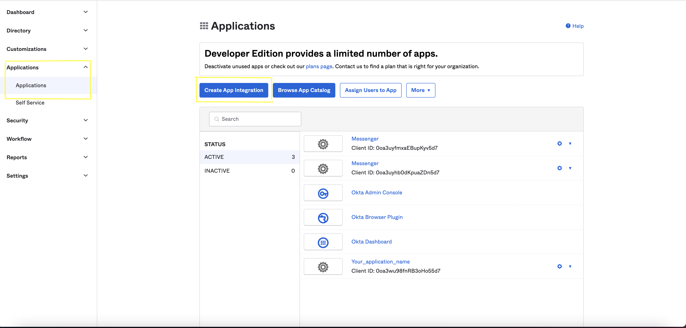

This Genesys Cloud Developer Blueprint provides instructions to integrate web messenger with OKTA to perform SSO integration. The blueprint also contains steps for setting up an OKTA account to get authorization credentials.

## Purpose

This page explains the steps that the users should follow to **Integrate Messenger** with the **Identity Provider-OKTA** via Genesys Cloud.

## Contents

- Solution components
- Prerequisites
- Implementation steps

## Solution components

**Genesys Cloud** - A suite of Genesys cloud services for enterprise-grade communications, collaboration, and contact center management. In this solution, a Genesys Cloud user account is required for your application to be authorized to integrate with Messenger.

## Prerequisites

## Specialized knowledge

Administrator-level knowledge of Genesys Cloud

## Genesys Cloud account

- A Genesys Cloud license. For more information on licensing, see [Genesys Cloud Pricing](https://www.genesys.com/pricing).
- The Master Admin role in Genesys Cloud. For more information, see [Roles and permissions overview](https://help.mypurecloud.com/articles/about-roles-permissions/) in the Genesys Cloud Resource Center.

## OKTA Developer account

- An OKTA developer account. To create an OKTA developer account, refer [this](https://developer.okta.com/signup/) link.

## Implementation Steps

Follow these instructions to integrate OKTA with Messenger.

- [OKTA Set up](#okta-set-up "Goes to the OKTA Set up section")
- [Configure Genesys Cloud](#configure-genesys-cloud "Goes to Configure Genesys Cloud")
- [Genesys Cloud Integration](#integration "Goes to Genesys Cloud Integration")
- [Messenger Configuration](#messenger-configuration "Goes to Messenger Configuration")
- [Messenger Deployment](#messenger-deployment "Goes to Messenger Deployment")
## OKTA Set-Up:

1. Login to your **OKTA** developer account.
2. In the left panel, select **Applications > Applications**. 
3. Click **Create App Integration**.

  

4. On the Create a new app integration page, select OpenID Connect in the Sign-in method section.
5. Choose, **Web Application** in Application Type and click next.
6. In the **New web app Integration page**, fill the following: 
      - In **App integration name**, enter a name for your app integration or leave it as default.
      - Select the required **Grant type**. 
      - Fill **Sign-in redirect URIs**. For local development use - http://{local_domain_name}. Example: http://localhost:8080/. *Note: Using localhost is just a way to test locally. This has to be the actual URL where messenger will initialize after login*
      - Similarly, fill **Sign-out redirect URIs**(http://{local_domain_name}).
     

7. In **Assignment** section, select option which best suites your organization and click Save. This creates the client credentials.

8. Store the Client credentials safely for using it in [Integration](#integration "Goes to Integration").
9. Now you are ready with **OKTA** set-up.

## Configure Genesys Cloud

To enable communication from **Genesys Cloud** to **Messenger** you must make changes in, 
  1. Integration
  2. Messenger Configuration
  3. Messenger Deployment

Login to Genesys Cloud account with your **Organization** and click **Admin** tab.

## Integration:

1. In **Genesys Cloud > Admin > Integrations**, click **+Integrations** button are the right corner. 

  

2. Install **OpenID Connect Messenger Configuration**.

  

3. In **Configuration** section, place the Discovery Uri - https://accounts.google.com/.well-known/openid-configuration.

  

4. In **Credentials** section, click Configure and fill your client credentials created in **OKTA** Set-up step.
5. Click save.
6. Navigate to the main Integrations page and set your integration to **Active**.

  

## Messenger Configuration:

1. In **Genesys Cloud > Admin > Messenger Configuration**, enable Authentication.
2. Select the **OAuth integration** created from [Genesys Cloud Integration](#integration "Goes to Genesys Cloud Integration step") from the dropdown.

  

## Messenger Deployment:

1. In **Genesys Cloud > Admin > Messenger Deployment**, select the **Configuration** created in the [Messenger Configuration](#messenger-configuration "Goes to Messenger Configuration step")

 

3. Save the deployment. This creates a single Snippet.
4. Use this single snippet on the website pages you would like the Messenger to appear.

 
